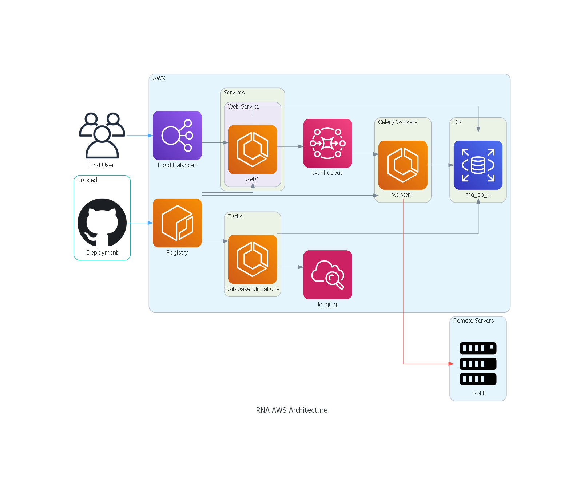

# RNA (Remote Network Automation)


[](https://codecov.io/gh/will7200/RNA)

## Goal

Test application – Simple 3 Tier, Network Automation.

+ Webapp that grabs routes from other Linux machines (ssh host “ip route”) and stores into a database for later viewing.
    + User authentication
    + CRUD (Each user has their own set of machines)
        + Add Machine
        + Show results
    + UI
        + Login page
        + Hosts list
        + Route detail page
    + Deployment for CI/CD (Github, Jenkins, ECS)

## Official Deployment:

[RNALoadBalancer-1745776977.us-west-2.elb.amazonaws.com](http://RNALoadBalancer-1745776977.us-west-2.elb.amazonaws.com)

Architecture


## CI/CD

All CI/CD is done using GITHUB Actions. Take a look at the Actions tab to view more information and the output of the
tools below.

### CI Tools

1. Lint with flake8
2. Static Analysis with mypy sqlalchemy-stubs to check database creation
3. Testing with pytest
4. Coverage with Codecov generated from pytest-cov

### Continuous Deployment

Since I only need one env for this everything is working out of the master branch. If the CI workflow has a success it
will initiate the deployment workflow.

#### Process

1. Build All Images. Images are built using docker-compose since there are quite a few.
2. Push Built Images to AWS ECR
3. Push New Task Definitions with the new image to AWS ECS
4. Update ECS Service to use new Task Definition Revision

#### Database Migrations

Database migrations will need a planned effort and in this setup will require multiple commits.  
In the case of adding to a model:

+ Commit 1: Add definitions to model and create migrations.
+ Commit 2: Use newly created definitions in source code.

Case Removing from model:

+ Commit 1: Remove source code uses of definitions
+ Commit 2: Remove definitions from models and create migrations

Case Renaming from model:  
This one is a bit harder but in general it should follow

+ Commit 1: Create a replicated column with the new name and create migrations
+ Commit 2: Update source code uses of definitions
+ Commit 3: Drop unused model definitions and create new migrations

Database Migration are created using flask migrate which uses Alembic under the hood.

### Local Development

Task is used as an alternative to use make. Read more about it [here](https://taskfile.dev/#/). Look
at [Taskfile](Taskfile.yml) for some

A docker-compose file is provided to get a running version on a local machine.

```bash
docker-compose build # build all the images
docker-compose up # use option -d to run in background
```

*Note The database migration container might timeout to the database. In that case wait for the database to come online
and start the migration again to run.

The next step is to add a user in the flask shell.

```base
docker exec -it rna_web_1 /bin/bash
export 'FLASK_APP=rna.app:create_app()'
flask shell
### Next Commands run in flask
from rna.modules.users.model import User, Role
from rna.extensions import db
user = User(username="admin", email="email@example.com")
user.set_password("password")
user.roles.append(Role(name='admin'))
db.session.add(user)
db.session.commit()
exit()
```

After that go to [localhost:5057](http://localhost:5057)

This setup also includes a testing machine that can be tested against. When entering a new host set the hostname to
rna_client with the username and password both being 'test'.  
To test RSA Private Key with test machine follow the below script to get a private key to use for testing. The test
machine exposes port 2022 on the host machine.

```bash
ssh-keygen # create a new id that won't be used anywhere else
ssh-copy-id -i ${NEW_RSA_ID} -p 2022 test@localhost # password test
ssh -p 2022 test@localhost # test to make sure identity worked
cat ${NEW_RSA_ID} # use this output in private key form field
```

